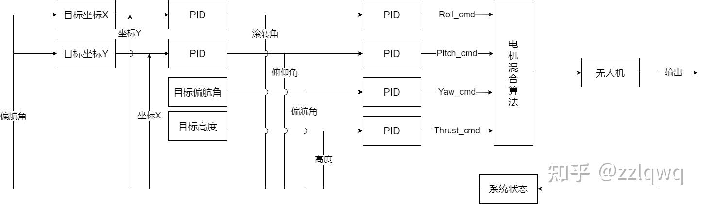

# 三维飞控系统模拟

## 飞控结构图



## 借物表 【参考与引用】
1. 无人机的3D模型: https://poly.pizza/m/fiYuC73Xlwp
2. 无人机飞控的教程: https://zhuanlan.zhihu.com/p/455984100


## 使用wasm运行

```
# 编译为wasm
cargo b --target wasm32-unknown-unknown --release

# 运行在浏览器上
wasm-server-runner target/wasm32-unknown-unknown/release/drone_control_simu.wasm
```

## 将wasm嵌入到静态网页

```
wasm-bindgen --no-typescript --target web \
    --out-dir ./out/ \
    --out-name "drone_simu" \
    target/wasm32-unknown-unknown/release/drone_control_simu.wasm
```

## 鸣谢

感谢燕山大学网络信息协会提供的服务器和sgt同学提供的电脑

♥️